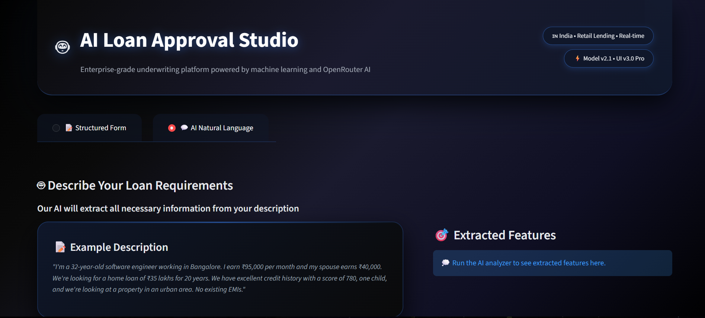

AI Loan Approval Studio

An enterprise-grade AI-powered loan underwriting system built with Streamlit, Machine Learning, and OpenRouter AI.
This application predicts loan approval, visualizes risk metrics, extracts structured data from natural language, and generates intelligent recommendations.

Built for fintech-style real-world use cases.

🚀 Features

🧠 Machine Learning Loan Prediction

💬 Natural Language Input (AI Extraction)

📊 Interactive Confidence Gauge & Metrics

📄 PDF Report Generation

🤖 AI Credit Officer Recommendations

🎨 Premium Fintech UI (Custom CSS)

🔐 Secure API usage with Streamlit Secrets

⚡ Real-time prediction pipeline

🧾 Export results as JSON & PDF

🖥️ Demo Screens

Add screenshots here once uploaded:

  

🧠 Tech Stack

Frontend/UI: Streamlit + Custom CSS

Backend: Python

Machine Learning: Scikit-learn (Pickle model + Scaler)

AI Integration: OpenRouter API (LLM-based extraction & recommendations)

Visualization: Plotly

PDF Reports: FPDF

Deployment-ready

📂 Project Structure
.
├── app.py                     # Main Streamlit app
├── loan_model.pkl             # Trained ML model + scaler
├── requirements.txt
├── .streamlit/
│   └── secrets.toml           # API keys (not committed)
└── README.md

⚙️ Installation & Setup
1️⃣ Clone the repository
git clone https://github.com/yourusername/ai-loan-approval-studio.git
cd ai-loan-approval-studio

2️⃣ Create virtual environment (recommended)
python -m venv venv
venv\Scripts\activate     # Windows
# OR
source venv/bin/activate  # macOS/Linux

3️⃣ Install dependencies
pip install -r requirements.txt

🔐 Configure OpenRouter API (Optional but powerful)

Create file:

.streamlit/secrets.toml

Add:

OPENROUTER_API_KEY = "sk-or-v1-xxxxxxxxxxxxxxxx"
OPENROUTER_MODEL = "openai/gpt-4o-mini"
APP_URL = "http://localhost:8501"
APP_NAME = "AI Loan Approval Studio"

Without this, ML predictions still work but AI features are disabled.

▶️ Run the Application
streamlit run app.py

Then open:

http://localhost:8501

🧪 Example Natural Language Input

You can paste this into the AI tab:

"I'm a software engineer earning ₹90,000 per month. My wife earns ₹40,000. We want a home loan of ₹30 lakhs for 20 years. We have good credit history, one child, and are buying an urban property."

The system will:

Extract features using AI

Run ML prediction

Show confidence

Generate recommendations

Allow PDF export

📊 Model Inputs Used
Feature	Type
Gender	Male / Female
Married	Yes / No
Dependents	0 / 1 / 2 / 3+
Education	Graduate / Not Graduate
Self Employed	Yes / No
Applicant Income	Integer
Co-applicant Income	Integer
Loan Amount	Integer
Loan Term	Months
Credit History	0 / 1
Property Area	Urban / Semiurban / Rural
📄 PDF Report Includes

Loan Decision

Confidence Score

Applicant Details

Financial Summary

Ratios (DTI, LTI)

Timestamped professional report

💡 Use Cases

Fintech MVPs

Hackathons

AI + ML Portfolio Projects

Resume Projects

Startup Prototypes

Internship Demonstrations

📌 Future Improvements

 SHAP explainability dashboard

 Model retraining UI

 Database integration

 User authentication

 Admin dashboard

 Cloud deployment (AWS/GCP)

👨‍💻 Author

Vasishta Mahi Tej Dronadula
🎓 B.Tech IT (2022–2026)
📍 Vijayawada, India
💼 Full-Stack & AI Developer

⭐ If you like this project

Give it a star ⭐ on GitHub — it helps a lot!
